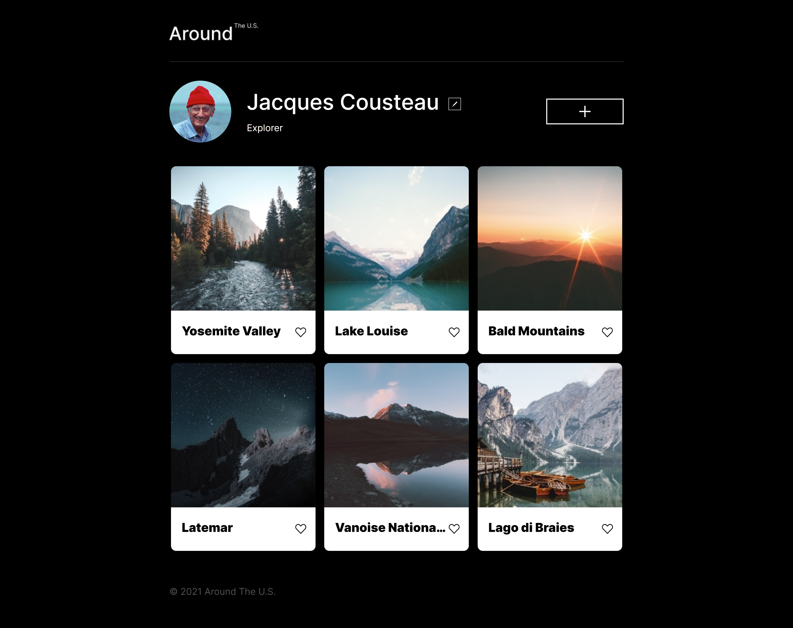

# Around The U.S. landing page with popup

## Table of contents

- [Overview](#overview)
  - [The challenge](#the-challenge)
  - [Screenshot](#screenshot)
  - [Links](#links)
- [My process](#my-process)
  - [Built with](#built-with)
  - [Continued development](#continued-development)
- [Author](#author)
- [Acknowledgments](#acknowledgments)

## Overview

### The challenge

Users should be able to:

- View the optimal layout depending on their device's screen size
- See hover states for interactive elements
- Edit the profile name and title
- Popup would open when the edit button clicked
- Add new cards
- Image preview will display when image clicked
- Like button will change the heart state to black

### Screenshot

### Links

- Github Repository: https://github.com/Glebkas/web_project_4
- Live Site URL: https://glebkas.github.io/web_project_4/

## My process

### Built with

- Semantic HTML5 markup
- CSS custom properties
- Flexbox
- CSS Grid
- JavaScript

### Continued development

## Author

Guy Gleb Kasner

## Acknowledgments

Part of Yandex Practicum web developer course project
